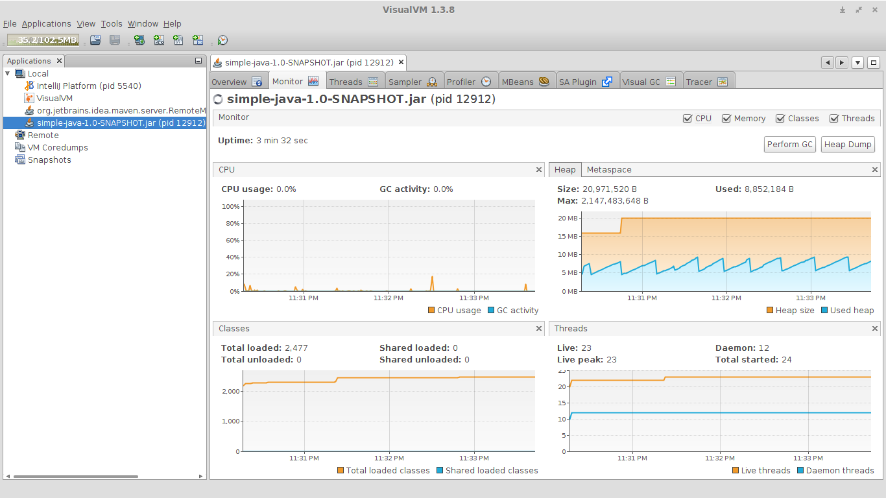

# Project Seed

This repository serves me as some technology I experimented on (read: quick start project).

## How to try the Spark Microframework

- Make sure you have jdk 8 installed.

- Run `mvn clean package` to create uber jar.

- Run `java -jar -Xms16m -Xmx2048m target/simple-java-1.0-SNAPSHOT.jar` to start the app.

- Open [http://localhost:4567/hello](http://localhost:4567/hello).

When I test for some minute, the resource usage is fairly minimum (I included logback on test):

